# ABMS Finance Domain ERD

Last verified: 2026-08-05

This is the complete logical ERD for the ABMS-owned finance domain and the external entities it relies on. Cross-database and polymorphic links are logical unless a migration explicitly defines a foreign key.

```mermaid
erDiagram
    ACCOUNTS {
        bigint id PK
        bigint parent_id FK "nullable; root when null"
        string account_code "not unique"
        string account_name
        string SAP_account_no_acad "nullable; not unique"
        string SAP_account_no_non_acad "nullable; not unique"
        boolean is_consolidated_acct
        boolean is_qty_check
        string account_group "nullable: assets liability capital expenses Cmb1"
        datetime deleted_at
    }
    BUDGET_PROPOSAL_ENTRY {
        bigint id PK
        bigint user_id "logical user reference"
        bigint department_id "nullable logical FK"
        bigint section_id "nullable logical FK"
        string school_year
        decimal total_cost
        decimal approved_total_cost
        decimal released
        decimal unused_amount
        decimal balance
        datetime deleted_at
    }
    SUB_ACCOUNTS {
        bigint id PK
        bigint account_id FK "allocated child account"
        bigint proposal_id FK
        decimal total_cost
        decimal approved_total_cost
        decimal released
        decimal unused_amount
        decimal balance
        datetime deleted_at
    }
    BUDGET_PROPOSAL_ENTRY_ITEMS {
        bigint id PK
        bigint sub_account_id FK
        string description
        decimal unit_cost
        string unit_measurement
        bigint quantity
        decimal total_cost
        decimal approved_total_cost
        string remarks
        boolean status
        datetime deleted_at
    }
    BUDGET_ADJUSTMENT_ENTRY {
        bigint id PK
        bigint department_id "nullable logical FK"
        bigint section_id "nullable logical FK"
        bigint main_account_id FK
        bigint sub_account_id FK
        string description
        decimal additional
        decimal deduction
        string school_year
        datetime deleted_at
    }
    BUDGET_REQUEST_ENTRY {
        bigint id PK
        bigint requisition_number
        string rstype
        string payee "nullable"
        string payment_form "nullable"
        bigint department_id "nullable logical FK"
        bigint section_id "nullable logical FK"
        string requested_by "nullable logical user reference"
        string status
        decimal total_amount
        string school_year
        string location
        string from
        string note
        tinyint is_controlled "0 pending; 1 approved; 2 disapproved; default 0"
        boolean for_liquidation
        boolean is_cash_advance "cashier RS tag; default false"
        boolean is_approve
        string remarks
        boolean is_liquidated
        string liquidated_by "nullable authenticated username"
        datetime liquidation_date "nullable latest save time"
        decimal liquidated_amount "nullable decimal 15,2"
        decimal returned_amount "nullable decimal 15,2"
        datetime deleted_at
    }
    BUDGET_REQUEST_ENTRY_ITEMS {
        bigint id PK
        bigint budget_request_entry_id FK
        bigint account_id FK "legacy value may be zero"
        string account_code "historical display and guarded fallback"
        string description
        decimal unit_cost
        int quantity
        string unit_of_measurement
        decimal total_cost
        decimal quoted_price
        decimal unused_amount
        boolean isreviewed
        datetime deleted_at
    }
    PAYEE_DETAILS {
        bigint id PK
        bigint budget_requisition_entry_id FK
        string tin
        boolean is_adu_employee
        boolean is_vat_registered
        boolean is_cheque
        boolean is_bank
        string bank_name
        string account_name
        string account_number
        string bank_address
        datetime deleted_at
    }
    BUDGET_REQUEST_ENTRY_CHATS {
        bigint id PK
        bigint budget_request_entry_id FK
        string sender_id
        string sender_name
        text message
    }
    BUDGET_REQUEST_ENTRY_CHAT_READS {
        bigint id PK
        bigint budget_request_entry_id FK
        string user_id
        bigint last_read_chat_id FK
    }
    USER_PERMISSIONS {
        bigint id PK
        string user_id "logical auth identity"
        bigint department_id "nullable logical FK"
        bigint section_id "nullable logical FK"
        bigint permission_id "logical permission reference"
        datetime proposal_entry_from
        datetime proposal_entry_to
    }
    USER_GENERAL_PERMISSIONS {
        bigint id PK
        string user_id "logical auth identity"
        bigint permission_id "logical permission reference"
    }
    BUDGET_SETTINGS {
        bigint id PK
        string current_school_year
        string proposal_entry_school_year
        datetime allow_entry_from
        datetime allow_entry_to
    }
    BUDGET_STATUS {
        bigint id PK
        int status_no
        string department
        string budget
        string logistics
        string accounting
        string stockroom
        string cashier
        datetime deleted_at
    }
    OFFICE_SUPPLIES {
        bigint id PK
        string item_code "client-provided; unique including soft-deleted rows"
        string item_name
        decimal unit_cost
        string unit_measurement
        datetime deleted_at
    }
    AUDITS {
        bigint id PK
        string user_type
        bigint user_id
        string event
        string auditable_type
        bigint auditable_id
        json old_values
        json new_values
        datetime created_at
    }
    BUDGET_REQUEST_ENTRY_PRINT_EVENTS {
        bigint id PK
        bigint budget_request_entry_id FK
        bigint user_id "authenticated user snapshot"
        string username "employee-number snapshot"
        string user_name "resolved full-name snapshot"
        datetime created_at
        datetime updated_at
    }
    MEDIA {
        bigint id PK
        string model_type
        bigint model_id
        string collection_name
        string file_name
        string mime_type
    }
    DIVISION_TYPES {
        bigint cid PK
        string code
        string type_name
    }
    DIVISIONS {
        bigint cid PK
        string div_code
        string div_name
        string type "logical FK to division type"
        boolean isactive
    }
    DEPARTMENTS {
        bigint cid PK
        string dep_code
        string dep_name
        bigint division_id FK
        boolean isactive
        boolean isbudget
    }
    SECTIONS {
        bigint cid PK
        string sec_code
        string sec_name
        bigint department_id FK
        boolean isactive
        boolean isbudget
        string sapcostcenter
    }
    TEACHERS {
        bigint id PK
        string emp_no
        string fname
        string mname
        string lname
        bigint dept_id "logical FK"
        bigint section_id "logical FK"
    }
    AUTH_IDENTITIES {
        string user_id PK "cross-service username or employee identity"
        string full_name
    }
    PERMISSION_CATALOG {
        bigint permission_id PK "cross-service permission identity"
        string name
    }

    ACCOUNTS ||--o{ ACCOUNTS : "parent of"
    ACCOUNTS ||--o{ SUB_ACCOUNTS : "allocated as child"
    BUDGET_PROPOSAL_ENTRY ||--o{ SUB_ACCOUNTS : contains
    SUB_ACCOUNTS ||--o{ BUDGET_PROPOSAL_ENTRY_ITEMS : contains

    ACCOUNTS ||--o{ BUDGET_ADJUSTMENT_ENTRY : "main account"
    ACCOUNTS ||--o{ BUDGET_ADJUSTMENT_ENTRY : "sub account"
    BUDGET_REQUEST_ENTRY ||--o{ BUDGET_REQUEST_ENTRY_ITEMS : contains
    ACCOUNTS ||--o{ BUDGET_REQUEST_ENTRY_ITEMS : "identified by account_id"
    BUDGET_REQUEST_ENTRY ||--o| PAYEE_DETAILS : has
    BUDGET_REQUEST_ENTRY ||--o{ BUDGET_REQUEST_ENTRY_CHATS : has
    BUDGET_REQUEST_ENTRY ||--o{ BUDGET_REQUEST_ENTRY_CHAT_READS : tracks
    BUDGET_REQUEST_ENTRY_CHATS ||--o{ BUDGET_REQUEST_ENTRY_CHAT_READS : "last read"

    DIVISION_TYPES ||--o{ DIVISIONS : classifies
    DIVISIONS ||--o{ DEPARTMENTS : contains
    DEPARTMENTS ||--o{ SECTIONS : contains
    DEPARTMENTS ||--o{ BUDGET_PROPOSAL_ENTRY : "typed owner"
    SECTIONS ||--o{ BUDGET_PROPOSAL_ENTRY : "typed owner"
    DEPARTMENTS ||--o{ BUDGET_ADJUSTMENT_ENTRY : "typed owner"
    SECTIONS ||--o{ BUDGET_ADJUSTMENT_ENTRY : "typed owner"
    DEPARTMENTS ||--o{ BUDGET_REQUEST_ENTRY : "typed owner"
    SECTIONS ||--o{ BUDGET_REQUEST_ENTRY : "typed owner"
    DEPARTMENTS ||--o{ USER_PERMISSIONS : scopes
    SECTIONS ||--o{ USER_PERMISSIONS : scopes
    DEPARTMENTS ||--o{ TEACHERS : assigns
    SECTIONS ||--o{ TEACHERS : assigns

    AUTH_IDENTITIES ||--o{ USER_PERMISSIONS : receives
    AUTH_IDENTITIES ||--o{ USER_GENERAL_PERMISSIONS : receives
    PERMISSION_CATALOG ||--o{ USER_PERMISSIONS : grants
    PERMISSION_CATALOG ||--o{ USER_GENERAL_PERMISSIONS : grants

    ACCOUNTS ||--o{ AUDITS : "polymorphic audit"
    BUDGET_PROPOSAL_ENTRY ||--o{ AUDITS : "polymorphic audit"
    SUB_ACCOUNTS ||--o{ AUDITS : "polymorphic audit"
    BUDGET_ADJUSTMENT_ENTRY ||--o{ AUDITS : "polymorphic audit"
    BUDGET_REQUEST_ENTRY ||--o{ AUDITS : "polymorphic audit"
    BUDGET_REQUEST_ENTRY_ITEMS ||--o{ AUDITS : "polymorphic audit"
    BUDGET_REQUEST_ENTRY ||--o{ BUDGET_REQUEST_ENTRY_PRINT_EVENTS : "printed through"
    BUDGET_REQUEST_ENTRY ||--o{ MEDIA : "polymorphic attachments"
```

## Relationship and Integrity Notes

- `accounts.parent_id` is the only account hierarchy. Duplicate root and sibling codes are valid; root and child uniqueness triggers/indexes have been removed or relaxed. Lookup indexes may remain non-unique.
- `sub_accounts.account_id` normally references a child account and `sub_accounts.proposal_id` references its owning proposal. Its name is historical; it represents an allocation. A positive Budget Adjustment may create a missing allocation under one existing current-year typed-unit proposal with `total_cost`, `approved_total_cost`, and `unused_amount` at zero and `balance` equal to the adjustment net; it does not create a proposal item or change approved/proposed totals.
- A requisition item's `account_id` is its current authoritative allocation identity. During initial number-`0` drafting and the separately guarded Budget-review stage it may be reassigned only by atomically refunding the old scoped allocation and debiting the new scoped allocation; `account_code` is refreshed from the selected server-side Account for display and audit history.
- Proposal, adjustment, and requisition ownership uses a department/section XOR. Database columns are nullable, so requests and services enforce the invariant.
- Organization and teacher relations cross database connections and may not have physical foreign keys.
- `audits` and `media` use type-and-ID polymorphic relationships. The arrows above document logical auditable/media owners rather than separate foreign keys.
- `budget_request_entry_print_events` is a dedicated append-only history stream. Each row belongs to one numbered requisition and snapshots the authenticated printer identity; there are no update/delete APIs, user deduplication, or historical backfill. Its rows are merged with audit records only when reading RS Process History and never participate in audit-based financial reconstruction.
- Permission identity and catalog records may live behind authentication/permission services. Their IDs are logical references in finance tables.
- Many business tables use soft deletes. Current operational queries and live date-ranged reports exclude trashed rows unless a specific report contract explicitly says otherwise.
- A saved liquidation summary is stored on `budget_request_entry`: returned amount is the sum of live item returns, liquidated amount is live item total cost less that return, and the username/date identify the latest successful save. This does not itself approve or remove the requisition from the liquidation queue.
- `budget_request_entry.is_controlled` is an unsigned tiny integer state, not a boolean: `0` means pending Controller decision, `1` approved, and `2` disapproved. Forwarding or re-forwarding to the Controller resets it to `0`; reprocessing also resets it. The column is non-null with database default `0` and is audited with the requisition model.

## Financial Hardening Tables and Precision

- `rs_number_sequences` has one row per calendar year (`year` primary key, `last_sequence`). Finalization locks this row before assigning a nonzero RS number. Draft requisitions retain number `0`; there is intentionally no unique constraint on `budget_request_entry.requisition_number`.
- `financial_idempotency_keys` records authenticated user, route/action, UUID key, canonical request hash, processing state, original response, and expiry. `(user_id, action, idempotency_key)` is unique.
- Proposal, allocation, adjustment, requisition, requisition-item, and office-supply monetary columns covered by task ABMS-CORE-20260724-001 use `DECIMAL(15,2)`. Existing `released`, `liquidated_amount`, and `returned_amount` remain `DECIMAL(15,2)`.
- Application balance decisions convert decimal strings to integer cents. Quantities remain integer values and are not money.

## Platform Tables Outside the Domain Diagram

The finance database also contains Laravel/platform tables such as `users`, OAuth access/auth/client/device/refresh-token tables, personal access tokens, password reset tokens, sessions, cache/locks, jobs/batches/failed jobs, and migration metadata. They support authentication and runtime infrastructure but do not add ABMS financial relationships, so the diagram represents their business-facing identity as `AUTH_IDENTITIES` rather than expanding framework internals.
