# ABMS Architecture and Workflow Flowcharts

Last verified: 2026-08-05

## System Context

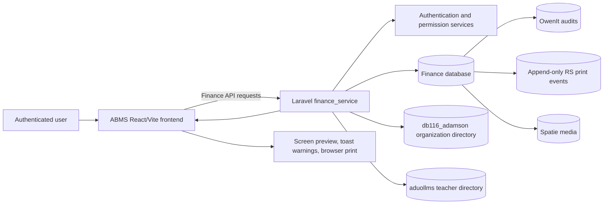

## Protected Route Bootstrap

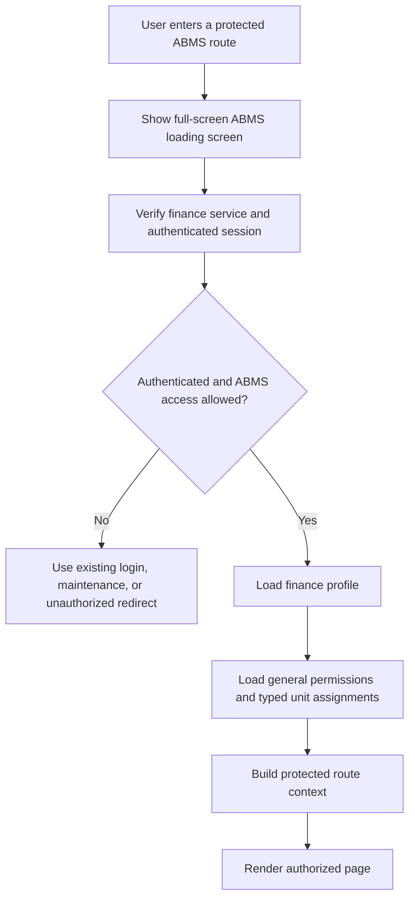

The protected route owns this bootstrap state. Its pending component appears immediately and remains visible briefly to prevent protected content from flashing before permission resolution. Production login redirects use `VITE_ADU_LIVE_PRODUCTION_URL`; localhost remains the development fallback.

## Proposal and Allocation

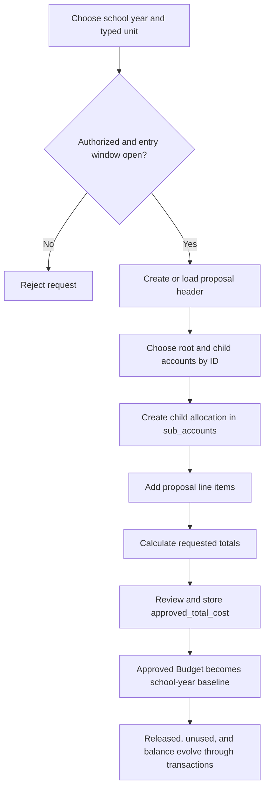

## Budget Adjustment Entry

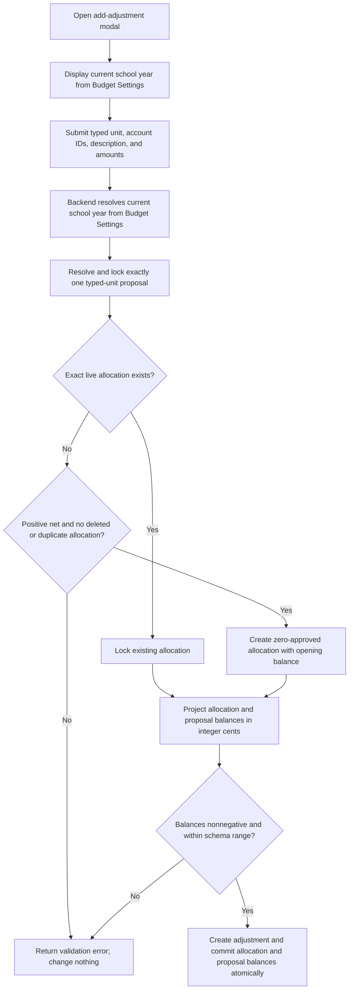

## Requisition and Balance Lifecycle

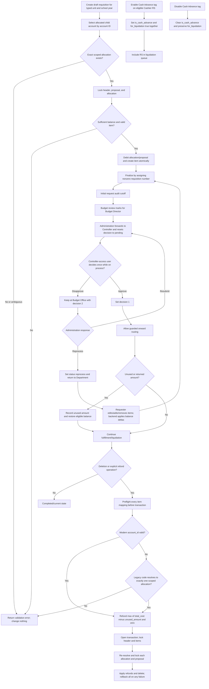

## Requisition Header Payee Rules

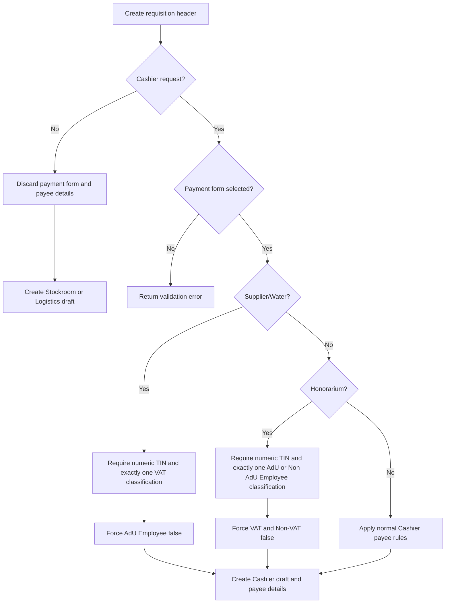

## Requisition Process Today Worklist

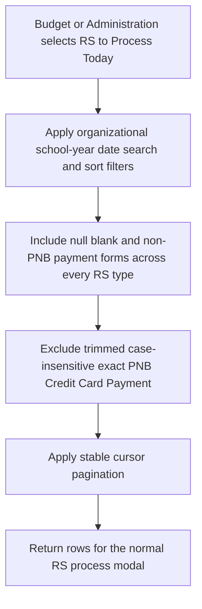

## Budget Review RS Item Editing

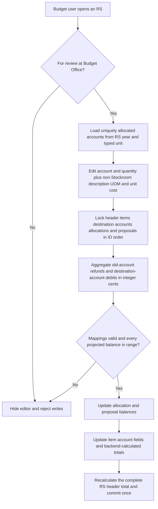

## Requisition Finalization and Quoted-Price Preview

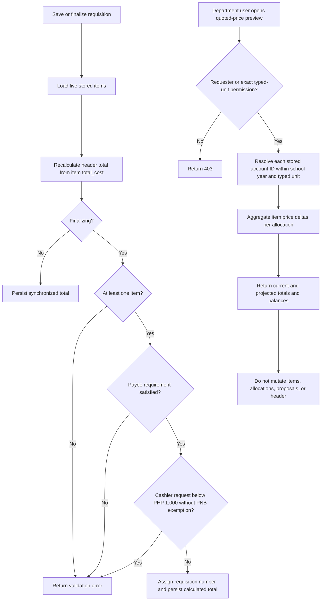

## Logistics Quoted-Price Confirmation

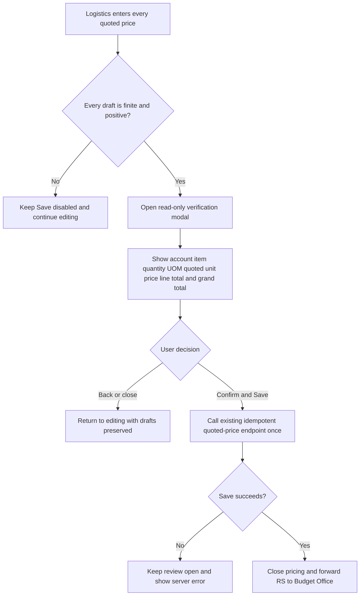

## Live Date-Range Report Projection

### Scoped Report Access

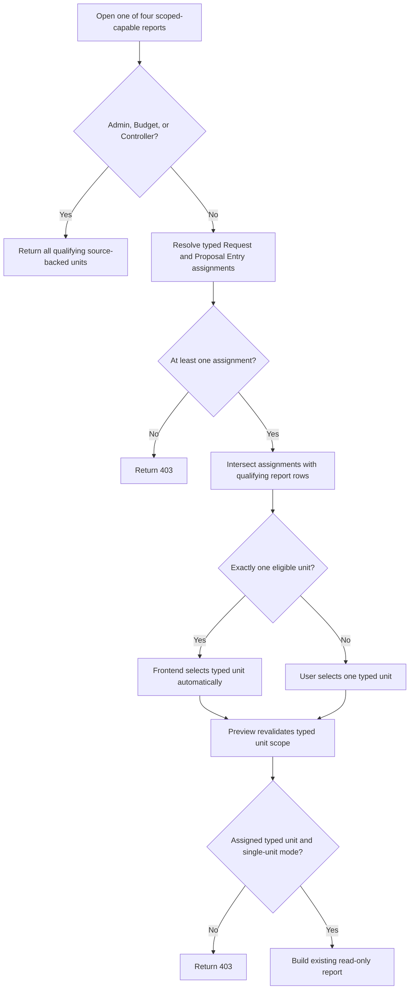

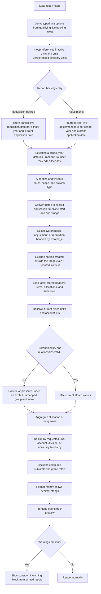

## Liquidation Returned-Amount Save

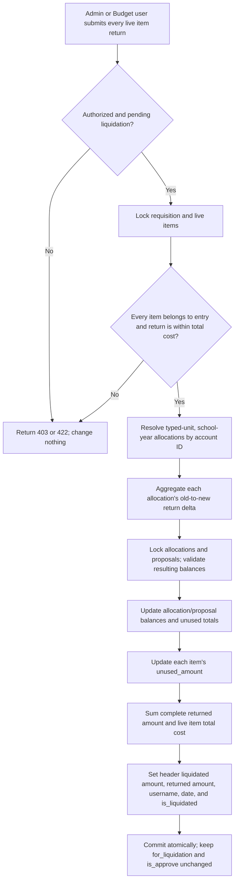

## Requested-Item Live Projection

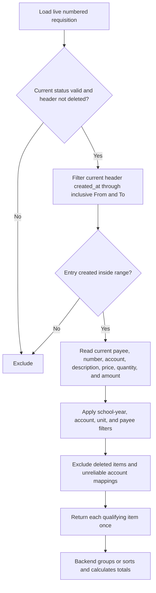

## Budget Liquidation Report

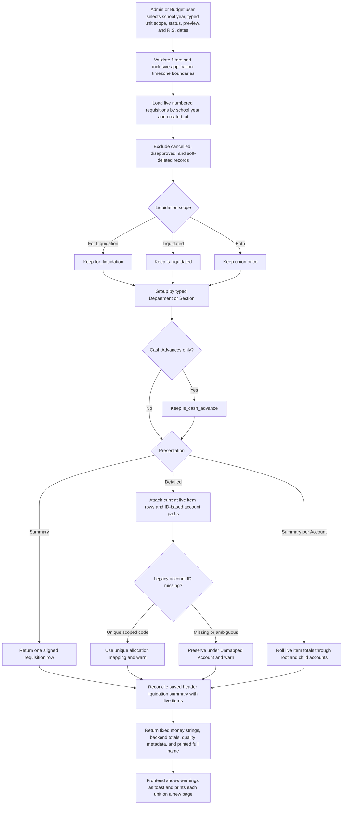

## Budget Proposal Details and Status Report

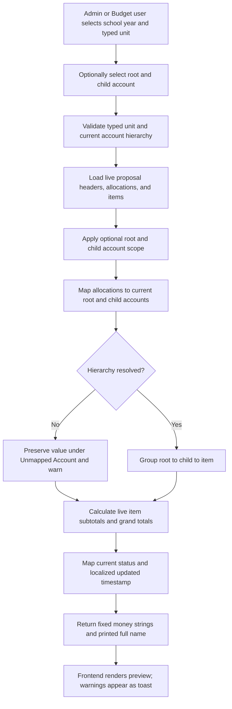

## University Budget Proposal Report

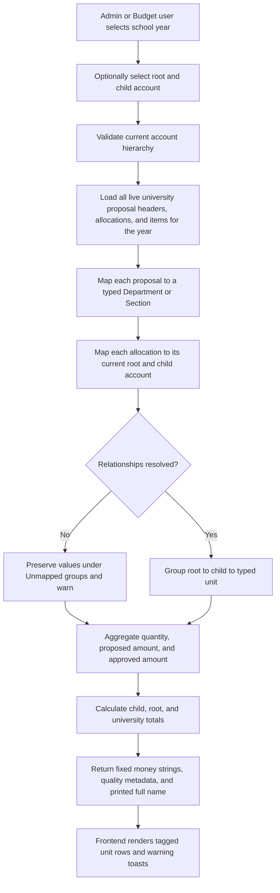

## Approved Budget Proposal Report

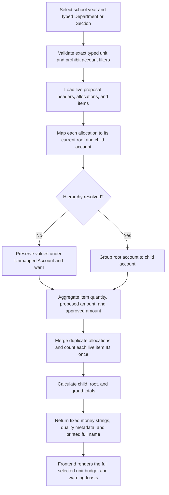

## Approved Items per Account Proposal Report

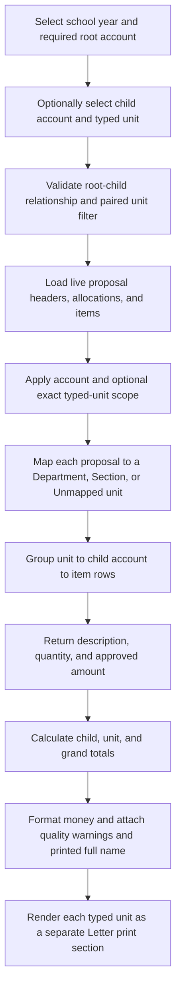

## Approved Items per Account/Department Proposal Report

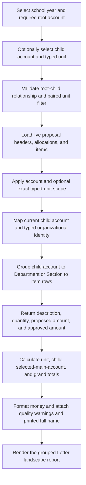

## Proposed versus Approved Percentage Proposal Report

```mermaid
flowchart TD
    A[Select school year and required typed unit] --> B[Optionally select root and child account]
    B --> C[Validate typed unit and root-child relationship]
    C --> D[Load live proposal headers, allocations, and items]
    D --> E[Map current root and child account identity]
    E --> F[Aggregate proposed and approved cents per child and root]
    F --> G[Calculate approved divided by proposed times 100]
    G --> H{Proposed amount is zero?}
    H -- Yes --> I[Return 0.00 percent]
    H -- No --> J[Round percentage to two decimals]
    I --> K[Return backend child, root, and grand totals]
    J --> K
    K --> L[Render Letter landscape preview with warnings and printed full name]
```

## Previous versus Current Approved Budget Report

```mermaid
flowchart TD
    A[Select previous school year and required typed unit] --> B[Read current school year from Budget Settings]
    B --> C{Current year exists and differs?}
    C -- No --> D[Return validation error]
    C -- Yes --> E[Optionally validate root and child account scope]
    E --> F[Load live proposals, allocations, and items for both years]
    F --> G[Map the union of current root and child account identities]
    G --> H[Aggregate previous and current approved cents independently]
    H --> I[Calculate current divided by previous times 100]
    I --> J{Previous approved amount is zero?}
    J -- Yes --> K[Return 0.00 percent]
    J -- No --> L[Round percentage to two decimals]
    K --> M[Return child, root, and grand totals]
    L --> M
    M --> N[Render Letter landscape preview with warnings and printed full name]
```

## Unserved RS Report

```mermaid
flowchart TD
    A[Select inclusive From and To dates] --> B[Optionally select current Location]
    B --> C[Validate dates, location, and report permission]
    C --> D[Load live numbered requisitions by created_at]
    D --> E[Exclude current Served and Served by WICO statuses]
    E --> F[Resolve typed Department or Section]
    F --> G[Read first certified-status audit for display date]
    G --> H[Group current Location to current Status to RS rows]
    H --> I[Calculate status, location, and grand totals]
    I --> J[Return fixed money strings, warnings, and printed full name]
    J --> K[Render each location as a Letter landscape print section]
```

## Authorization and Unit Scope

```mermaid
flowchart TD
    A[Authenticated identity] --> B[Load general permissions]
    A --> C[Load typed user_permissions]
    C --> D[Department assignments]
    C --> E[Section assignments]
    B --> F{General access grants requested operation?}
    D --> G{Requested department matches?}
    E --> H{Requested section matches?}
    F -- Yes --> I[Authorize broad scope]
    G -- Yes --> J[Authorize department scope]
    H -- Yes --> K[Authorize section scope]
    F -- No --> L{Typed assignment grants scope?}
    J --> M[Proceed]
    K --> M
    L -- No --> N[Return authorization error]
    L -- Yes --> M
    I --> M
```

## Change Impact Checklist

```mermaid
flowchart LR
    A[Proposed ABMS change] --> B{Changes schema or identity?}
    A --> C{Changes financial write path?}
    A --> D{Changes audits or reports?}
    A --> E{Changes authorization or UI contract?}
    B -- Yes --> F[Review ERD, migrations, rollback, ID/code lookups]
    C -- Yes --> G[Review locks, atomicity, balances, unused/refund behavior]
    D -- Yes --> H[Review created_at boundaries, live-value sources, warnings, and precision]
    E -- Yes --> I[Review typed scope, stale preview, loading/error, print]
    F --> J[Focused tests and regression suite]
    G --> J
    H --> J
    I --> J
    J --> K[Update docs/abms and task handoff]
```

## Uniform Report Printing

```mermaid
flowchart LR
    A[Open any ABMS report preview] --> B[Render shared 11 by 8.5 inch Letter landscape sheet]
    B --> C[Apply readable shared typography and a matching 0.30 inch preview inset]
    C --> D[Constrain tables and content to printable width]
    D --> E[Print with one printer-safe 0.30 inch page margin and no duplicate sheet padding]
    E --> F[Repeat table headers and preserve rows/totals]
    F --> G[Allow long groups to continue onto following Letter pages]
```

The shared Requisition Slip is the portrait exception: its screen preview is
8.5 by 11 inches, and print mode uses a 0.2-inch Letter page margin with no
duplicate inner print padding. Requisition Process and Budget Request Entry
both consume this same component.

## Auditable RS Printing

```mermaid
flowchart TD
    A[Open shared RS print preview] --> B[Choose paper preset]
    B --> C[Click Print]
    C --> D[Disable controls and show Preparing]
    D --> E[POST authenticated print event with UUID idempotency key]
    E --> F{Event recorded or replayed?}
    F -- No --> G[Keep preview and preset open; show retryable error]
    F -- Yes --> H[Refresh footer print date and time]
    H --> I[Open browser print dialog]
    I --> J[Later history request]
    J --> K[Load OwenIt audits and print events separately]
    K --> L[Map source-qualified history rows]
    L --> M[Merge with stable newest-first order]
```

Opening, closing, or changing paper creates no event. `Printed` records dialog initiation only. Print events remain outside OwenIt audits and therefore outside report and financial-history reconstruction.

## Uniform Report Excel Export

```mermaid
flowchart LR
    A[Open any ABMS report preview] --> B[Shared portal adds Export to Excel beside Print]
    B --> C[Read the active rendered preview only]
    C --> D[Preserve titles filters groups rows subtotals totals and footer]
    D --> E[Keep IDs codes requisition numbers labels and dates as text]
    D --> F[Write recognized money percentages and quantities as numeric cells]
    E --> G[Apply wrapping widths fills borders and hierarchy styles]
    F --> G
    G --> H[Generate Letter-landscape XLSX in an on-demand browser chunk]
    H --> I[Download descriptive filename without changing report data]
```

## Idempotent Financial Mutation

```mermaid
flowchart TD
    A[User starts one financial action] --> B[Frontend assigns UUID idempotency key]
    B --> C[Backend locks user plus action plus key]
    C --> D{Existing key?}
    D -- Completed same payload --> E[Replay original response]
    D -- Different payload --> F[Return 422]
    D -- In progress --> G[Return 409]
    D -- No --> H[Begin database transaction]
    H --> I[Lock financial rows and validate projected balances]
    I --> J{All checks pass?}
    J -- No --> K[Rollback mutation and key]
    J -- Yes --> L[Apply deltas and authoritative rollups]
    L --> M[Store completed response with 30-day expiry]
    M --> N[Commit once]
    N --> O[Return response]
```

## Finalized RS Numbering

```mermaid
flowchart TD
    A[Finalize locked requisition] --> B[Lock live items and recalculate header total]
    B --> C{Already has nonzero RS number?}
    C -- Yes --> D[Preserve current number]
    C -- No --> E[Lock calendar-year sequence row]
    E --> F[Increment last sequence]
    F --> G[Compose year plus six-digit sequence]
    D --> H[Save number total route status and timestamp]
    G --> H
    H --> I[Commit atomically]
```
