# ABMS Architecture and Workflow Flowcharts

Last verified: 2026-07-19

## System Context

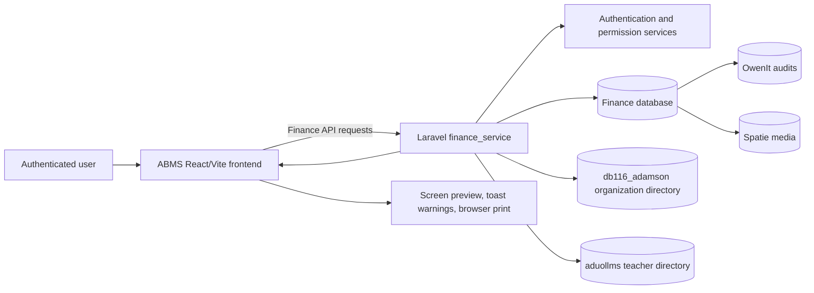

## Proposal and Allocation

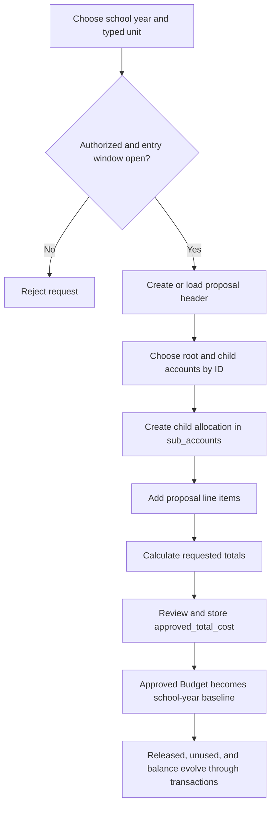

## Requisition and Balance Lifecycle

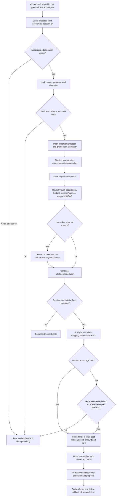

## Historical Report Projection

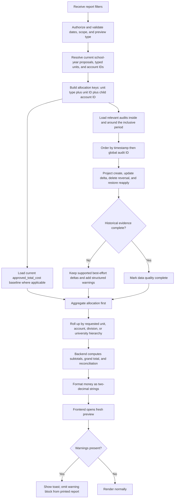

## Liquidation Returned-Amount Save

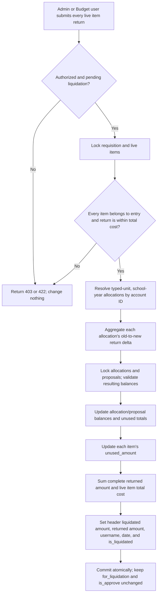

## Requested-Item Historical Snapshot

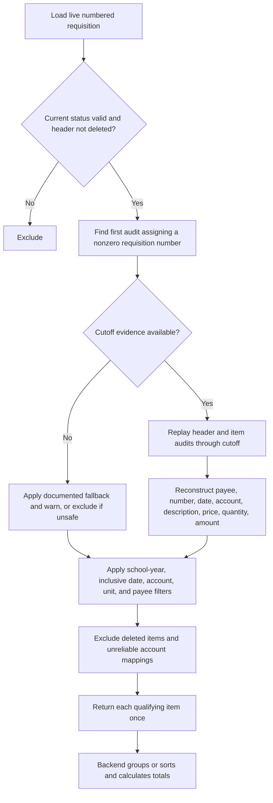

## Budget Liquidation Report

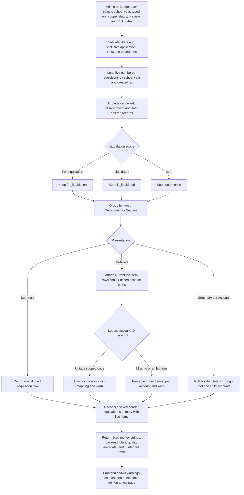

## Budget Proposal Details and Status Report

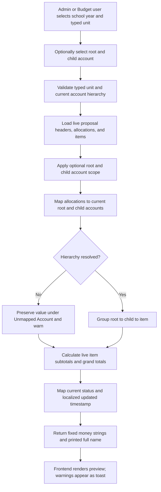

## University Budget Proposal Report

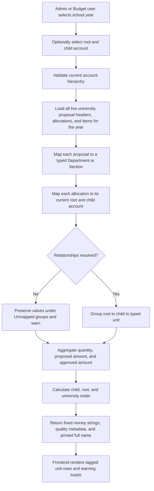

## Authorization and Unit Scope

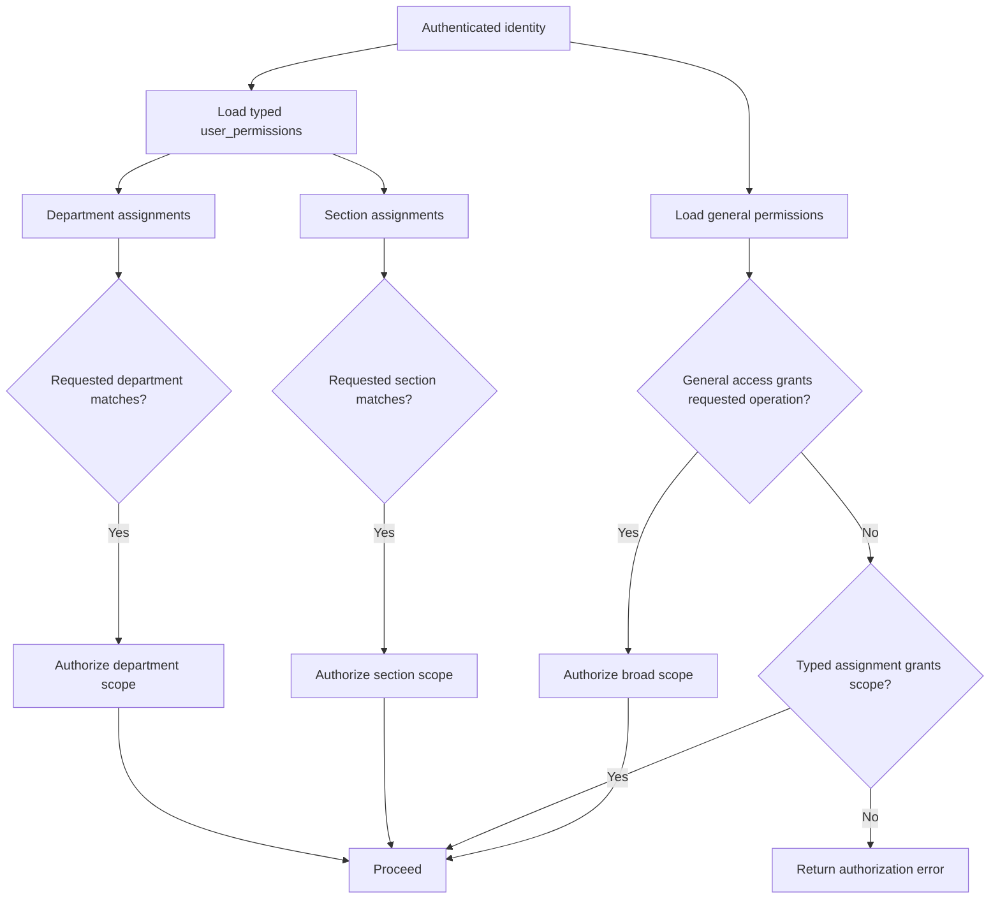

## Change Impact Checklist

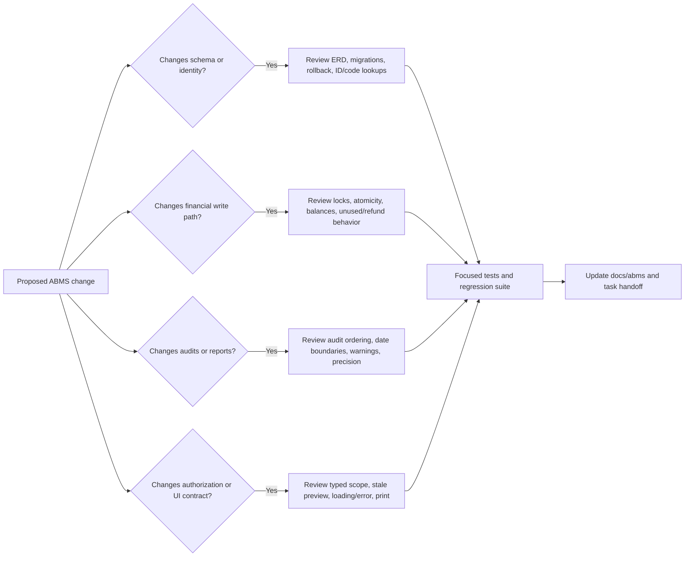

## Uniform Report Printing

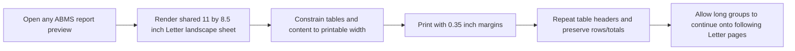
