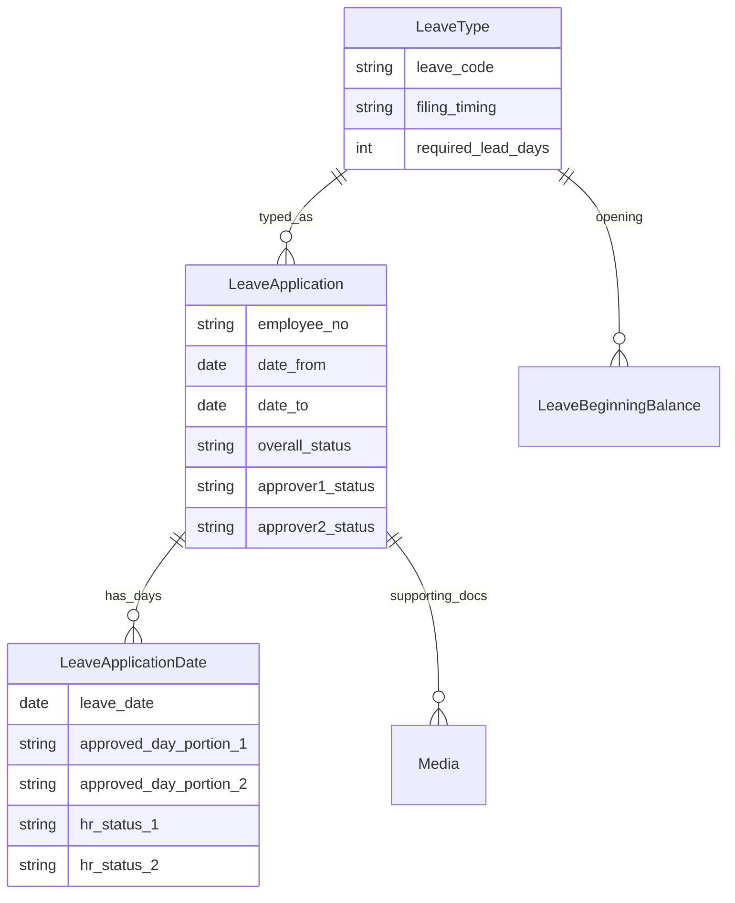
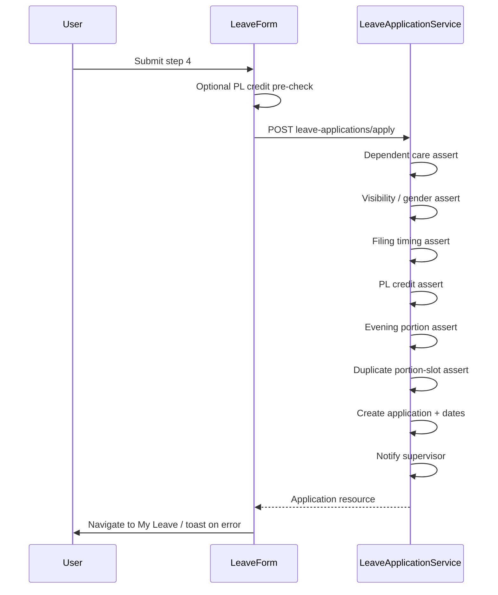
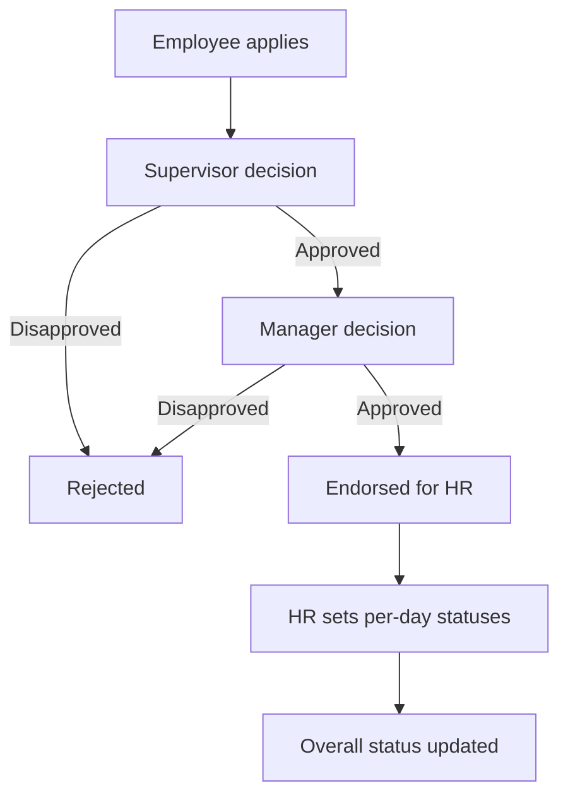

# E-Leave Architecture

Last verified: 2026-07-23

## Domain Model (simplified)

### Core entities

| Model | Role |
| --- | --- |
| `LeaveApplication` | Header: employee, type, range, reason, supervisor/manager decisions, overall status |
| `LeaveApplicationDate` | Per calendar day; optional split portions; HR status per portion |
| `LeaveType` | Code/name, filing timing, lead days, active/order |
| `LeaveBeginningBalance` | Opening balances by employee/type/year |
| `FlCutoffPreference` | School-year window for Forced Leave credit computation |
| `LeaveAfterCutoffPrintLog` | Print tracking for after-cutoff report |

Day portions: Whole Day, AM, PM, Evening. Weights and conflict slots live in `LeaveDayPortion` (`weight`, `slots`).

HR day statuses include: Pending, Approved With Pay, Approved Without Pay, Disapproved, Cancelled. Credits are consumed only for **Approved With Pay**.

## Frontend Route Map

| Path | Purpose | Access |
| --- | --- | --- |
| `/` | Redirect to My Leave | Authenticated |
| `/guidelines` | Leave guidelines | Authenticated |
| `/my-leave` | Balances + own applications | Authenticated |
| `/my-leave/leave-form/{-$leaveId}` | Apply (4-step) / edit stub | Authenticated |
| `/my-leave/view-leave/$leaveId` | View application | Authenticated |
| `/for-approval` | Supervisor/manager queue | Supervisor or manager |
| `/hr-approval` | HR queue + sheet | HR approval permissions |
| `/beginning-balances` | Admin CRUD | HR admin |
| `/employee-leave-credits` | Admin credits list | HR admin |
| `/settings/fl-cutoff` | FL cutoff prefs | HR admin |
| `/reports/filed-leave` | Filed leave report | HR admin |
| `/reports/filed-leave-after-cutoff` | After-cutoff report | HR admin |
| `/forbidden` | Access denied | Authenticated |

Apply form steps (`leave-form/`):

1. Dates (+ weekend exclusions)
2. Leave type + day portions
3. Reason, address, supporting documents
4. Review + submit

## Apply Flow

Authoritative validation is on the backend. FE may toast API errors and map field errors (`date_from`, `leave_type_id`, etc.).

## Approval Flows

1. **Supervisor / manager** — `PATCH leave-applications/{id}/decision` (middleware: supervisor or manager). Approver1 then approver2; actor who is both may complete both steps.
2. **HR** — applications reach HR when endorsed (`scopeEndorsedForHr`). `PATCH leave-application-dates/hr-approval` updates day portions/types/statuses and validates leave credits for Approved With Pay.

Emails: `LeaveApprovalNotificationService` (approval request + status mails).

## Key Backend Services

| Service | Responsibility |
| --- | --- |
| `LeaveApplicationService` | Apply, decisions, HR approval, listing, reports orchestration |
| `LeaveBalanceService` | Credit display formula |
| `LeaveCreditDeductionService` | Consumed totals; HR approval sufficiency |
| `LeaveApplyCreditValidationService` | Paternity credits at apply |
| `LeaveApplyDuplicateValidationService` | Portion-slot duplicate dates at apply |
| `LeaveTypeVisibilityService` | SIL/FL/gender visibility on types + assert |
| `LeaveFilingTimingService` | Filing windows per leave type |
| `LeaveDependentCareLimitService` | EL dependent-care yearly limit |
| `EveningDayPortionEligibilityService` | Who may select Evening |
| `EleavePermissionChecker` | Permission checks against AdULive DB |

## Frontend Lib / Hooks Pattern

- API clients under `apps/eleave/src/lib/*-api.ts`
- React Query hooks under `apps/eleave/src/hooks/`
- Access helpers: `eleave-access.ts`, `eleave-route-access.ts`
- Status helpers: `hr-approval-status.ts`, `my-leave/-leave-status.ts`
