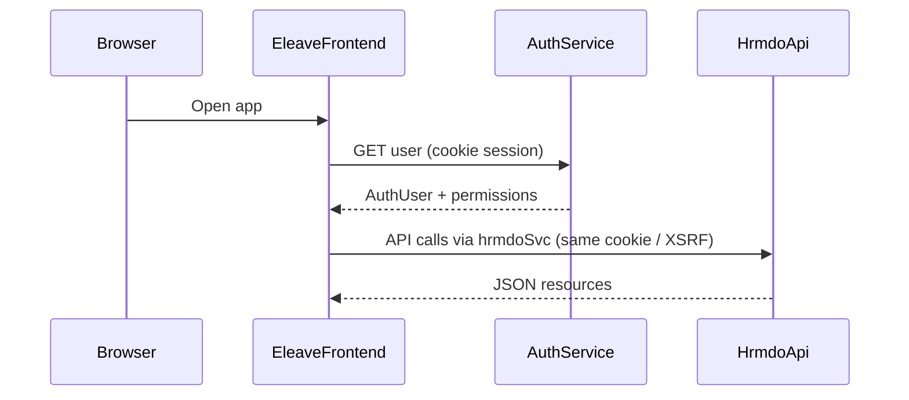

# E-Leave System Context

Last verified: 2026-07-23

## Purpose

E-Leave lets Adamson employees file leave applications, route them through supervisor/manager endorsement, and complete day-level HR approval with leave-credit accounting.

## Repository Map

| Concern | Location | Notes |
| --- | --- | --- |
| E-Leave frontend | `apps/eleave` | React, Vite, TanStack Router/Query, Tailwind, shadcn/ui |
| Shared frontend packages | `packages/` | `@repo/ui`, `@repo/axios-config`, shared tooling |
| HRMDO API | `../hrmdo_service` | Sibling Laravel service |
| E-Leave backend module | `../hrmdo_service/app-modules/eleave` | Routes, controllers, services, models, mail |
| Module config | `../hrmdo_service/config/eleave.php` | Permissions, frontend URL, media disk |
| Durable docs | `docs/eleave/` | This directory |

## Stack

### Frontend (`apps/eleave`)

- React 19 + TypeScript + Vite
- TanStack Router (file routes), TanStack Query, TanStack Table
- react-hook-form + Zod
- Cookie session via `@repo/axios-config` (`authSvc`, `hrmdoSvc`)
- Toasts: Sonner (`Toaster` in `src/routes/__root.tsx`)

### Backend (`modules/eleave`)

- Laravel module (`internachi/modular`), namespace `Modules\Eleave\`
- Passport / `auth:api` cookie-capable API
- Spatie Media Library for supporting documents (disk `eleave`)
- Email notifications for approval requests and status updates

## Runtime Data Boundaries

E-Leave spans several stores:

- **HRMDO / eleave DB** — leave applications, dates, types, beginning balances, FL cutoff preferences, after-cutoff print logs
- **aduollms** — teachers (employee directory, supervisor/manager links, employment flags)
- **HR Emp / leave credit tables** — gender (`sex`/`gender`), annual leave credit columns used by balances
- **Auth / AdULive permissions** — user identity and permission names (logical cross-service)

Relationships across databases are logical. Code must tolerate missing HR Emp gender or directory gaps (for example gender-gated leave types hide when gender cannot be resolved).

## Auth Flow

1. Root `beforeLoad` calls `ensureAuthenticated` → `authSvc.get("user")`.
2. Restricted routes also load HR profile when needed (`/for-approval`).
3. Unauthorized API responses redirect to login.

## Frontend Entry Points

Primary UI areas (see sidebar in `apps/eleave/src/components/app-sidebar.tsx`):

- Guidelines, My Leave, For Approval, HR Approval
- Admin: Beginning Balances, Employee Leave Credits, FL Cutoff Settings
- Reports: Filed Leave, Filed Leave After Cutoff

Access tiers are registered in `apps/eleave/src/lib/eleave-route-access.ts`.

## Backend Entry Points

Module routes mount under `auth:api` + `api` in `app-modules/eleave/routes/eleave-routes.php`, with versioned handlers under `api/v1/...`.

Config keys of note (`config/eleave.php`):

- `frontend_url` (`ELEAVE_FRONTEND_URL`) — email deep links
- `permissions.hr_approval` / `permissions.admin` / `permissions.dev`
- `media_disk` / `media_storage_path` — supporting documents storage
